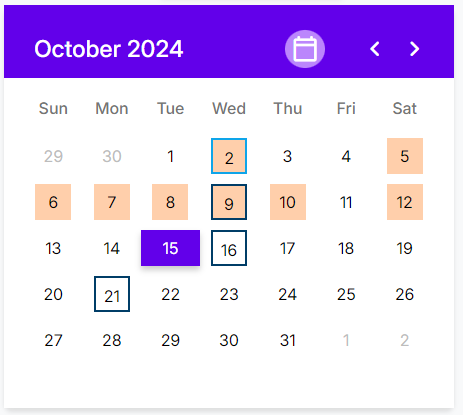
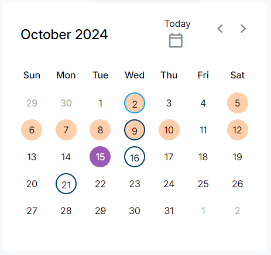

# ze calendar

## Objetivo

Um calendário interativo com três opções de temas, permitindo personalização visual através de imagens e a opção de destacar intervalos de datas específicas.

## Funcionalidades

- 4 temas disponíveis: **Bootstrap**, **Material**,  **My Style**, e **Default**
- Possibilidade de escolher entre três imagens de fundo para personalizar a aparência
- Destaque de intervalos de datas utilizando a funcionalidade de **range**, permitindo fácil visualização de datas importantes

## Demonstração

[Demo](https://ze-calander.vercel.app/)

<table>
  <tr>
    <td></td>
    <td></td>
    <td></td>
    <td></td>
  </tr>
  <tr>
    <td align="center">
Tema Bootstrap
</td>
    <td align="center">
Tema Material
</td>
    <td align="center">
Tema My Style
</td>
    <td align="center">
Tema Default
</td>
  </tr>
</table>
